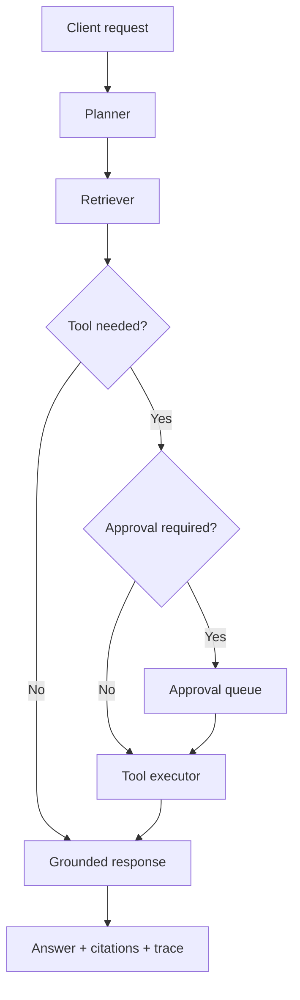

# Enterprise Agentic AI Platform

A production-minded reference implementation of an agentic AI service. It uses a state-machine workflow to plan requests, retrieve grounded context, call allow-listed tools, pause sensitive actions for human approval, and return answers with citations and an auditable execution trace.

> This repository is a portfolio demonstration built with synthetic data. It does not contain employer code, customer data, or proprietary benchmarks.

## What it demonstrates

- Planner → retriever → tool router → approval → response workflow
- Hybrid lexical/vector-style retrieval with source citations
- Tool registry with role-based access control and validated inputs
- Human-in-the-loop approval for sensitive operations
- Structured API responses and end-to-end execution traces
- Retry-safe, testable components with dependency injection
- FastAPI service, Docker image, health endpoint, tests, and CI

## Architecture



## Quick start

Requires Python 3.11+.

```bash
python -m venv .venv
source .venv/bin/activate       # Windows: .venv\Scripts\activate
pip install -e ".[dev]"
uvicorn app.main:app --reload
```

Open `http://localhost:8000/docs`.

### Try a grounded question

```bash
curl -X POST http://localhost:8000/v1/runs \
  -H "Content-Type: application/json" \
  -d '{"query":"What is the refund policy?","user_id":"demo-user","roles":["employee"]}'
```

### Try a sensitive action

```bash
curl -X POST http://localhost:8000/v1/runs \
  -H "Content-Type: application/json" \
  -d '{"query":"Create a refund for order ORD-100","user_id":"demo-user","roles":["support"]}'
```

The response returns `status: pending_approval`. Approve it using:

```bash
curl -X POST http://localhost:8000/v1/approvals/REQUEST_ID \
  -H "Content-Type: application/json" \
  -d '{"approved":true,"reviewer_id":"team-lead"}'
```

## API endpoints

| Method | Path | Purpose |
|---|---|---|
| GET | `/health` | Liveness check |
| POST | `/v1/runs` | Run or pause an agent workflow |
| GET | `/v1/approvals/{id}` | Inspect a pending approval |
| POST | `/v1/approvals/{id}` | Approve or reject an action |

## Run tests

```bash
pytest -q
```

## Docker

```bash
docker build -t enterprise-agentic-ai .
docker run --rm -p 8000:8000 enterprise-agentic-ai
```

## Production extension points

- Replace the deterministic response composer with OpenAI, Claude, Gemini, or Bedrock.
- Replace the in-memory knowledge base with pgvector, OpenSearch, Pinecone, or FAISS.
- Persist run state and approvals in PostgreSQL/Redis.
- Add OIDC authentication, secrets management, OpenTelemetry, and policy-as-code.
- Add offline RAG evaluation datasets and deployment quality gates.

## Responsible AI notes

The service treats retrieved text and tool results as untrusted inputs, restricts tools by role, requires approval for sensitive actions, and exposes citations and traces. Real deployments should also add PII redaction, tenant isolation, rate limiting, encrypted persistence, model-specific safety evaluation, and security review.

## License

MIT
